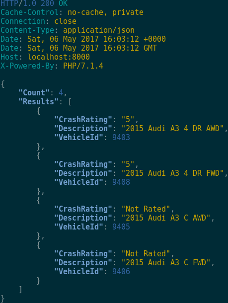

# [Vehicle Safety API](https://vehicle-safety-api.herokuapp.com/)
[](https://codeclimate.com/github/GuidoBR/nhtsa-wrapper-api)
[](https://travis-ci.org/GuidoBR/nhtsa-wrapper-api)
[](https://vehicle-safety-api.herokuapp.com/)

API to expose [NHTSA NCAP 5 Star Safety Ratings API](https://one.nhtsa.gov/webapi/Default.aspx?SafetyRatings/API/5)



## Installation

```
composer install
```

## Usage
```
php -S localhost:8080 -t public
```

### Get a vehicle

```
curl localhost:8080/vehicles/2015/audi/a5
```

### Get a vehicle with ratings
```
curl localhost:8080/vehicles/2015/audi/a3\?withRating\=true
```

### Post a vehicle

```
curl -d "modelYear=2015&manufacturer=Audi&model=A3" localhost:8080/vehicles
```

### Documentation

[Vehicle Safety API documentation](http://docs.vehiclesafetyapi.apiary.io)


## Running the tests

```
phpunit tests
```

## Built with

- [Lumen](https://lumen.laravel.com/)
